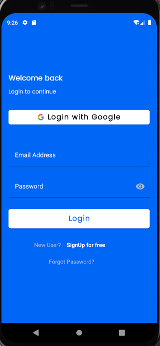

# Clads

Clads product is an android application designed in an attempt to solve an age old problem - disappointment from tailors. This application provides a platform for tailors to efficiently manage the information of their large client base in a centralised and organised fashion. The product eradicates the use of paper to store client information. With Clads, tailors no longer fear the loss of clients or clients’ data. 

They can now easily search for any client and update their details or contact them.
Customers get exactly what they requested, they are happy with their services and they bring their friends and loved ones.

## Development

Clads Codebase is designed to enable easy flow and collaboration among android native developers of all experiences, yet leveraging latest standards, architecture and best practces. Below and many more are the technologies that would be used. 

- [Dagger Hilt](https://dagger.dev/hilt/)
- [Jetpack ViewBinding](https://developer.android.com/topic/libraries/view-binding)
- [Jetpack LiveData](https://developer.android.com/topic/libraries/architecture/livedata)
- [JetPack Navigation Components](https://developer.android.com/guide/navigation/navigation-getting-started)
- [Kotlin](https://kotlinlang.org/) + [Kotlin Coroutines](https://kotlinlang.org/docs/reference/coroutines-overview.html)
- [Espresso](https://developer.android.com/training/testing/espresso) & [Robolectric for testing](http://robolectric.org/)
- And many more

